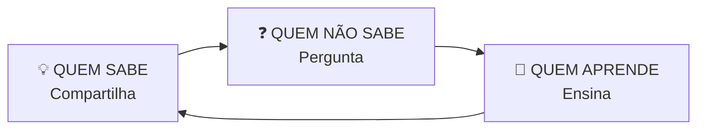
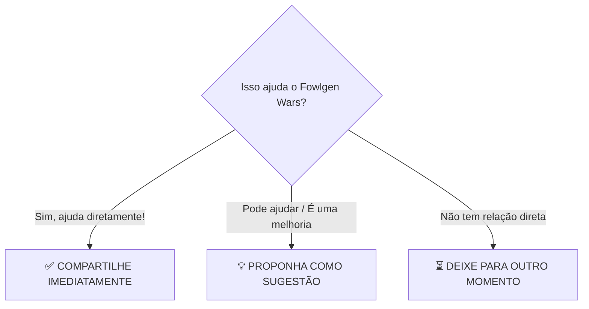
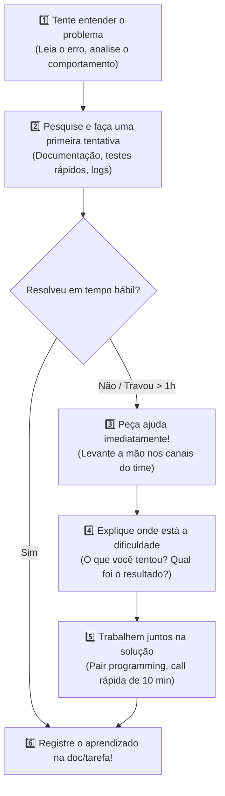
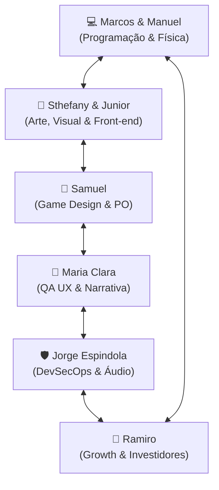

# 🎮 G5B STUDIOS — CÓDIGO DE PRINCÍPIOS DE COLABORAÇÃO DA EQUIPE
## Guia de Cultura, Aprendizado Mútuo e Comunicação Ágil no Desenvolvimento do FOWLGEN WARS

> **🐔 REGRA FUNDAMENTAL DA G5B STUDIOS:**  
> **NÃO COMPETIMOS UNS CONTRA OS OUTROS. COMPETIMOS JUNTOS PELO CRESCIMENTO DO PROJETO.**  
> Aqui, pedir ajuda é responsabilidade. Ensinar é colaboração. Aprender é parte intrínseca do trabalho. E fazer o jogo avançar é o objetivo de todos.

---

## 🤝 1. Ajude e Você Será Ajudado

Ninguém nasce sabendo tudo.

Estamos desenvolvendo um jogo pioneiro e desafiador, e **ninguém precisa dominar todas as áreas** para fazer parte da equipe.

Se você encontrou uma dificuldade técnica, de design, de processo ou de tempo:  
**NÃO FIQUE TRAVADO SOZINHO.**

### ✋ LEVANTE A MÃO. PERGUNTE. PEÇA AJUDA.

> *“Uma cabeça pode encontrar uma solução.  
> Várias cabeças reunidas encontram uma solução muito melhor.”*

* 🟢 **Perguntar NÃO é vergonha:** É sinal de maturidade profissional e respeito pelo tempo do projeto.
* 🟢 **Não saber algo NÃO é problema:** Ninguém domina Unity, Solana, Rust, Arte 2D, UX, Áudio e DevSecOps ao mesmo tempo.
* 🔴 **O verdadeiro problema é:** Ficar travado em silêncio, não comunicar e deixar o projeto parado por dias.

---

## 🧠 2. Ensinar Também é Aprender

Se você domina uma ferramenta, resolveu um bug difícil ou aprendeu algo novo: **ENSINE**.

Quando você explica uma solução para um colega:
1. Você organiza o seu próprio raciocínio mental.
2. Identifica possíveis falhas que passaram despercebidas.
3. Aperfeiçoa sua capacidade de liderança e comunicação técnica.

> **Princípio:** O conhecimento técnico e criativo da G5B Studios **nunca** deve ficar centralizado em uma única pessoa. Informação retida é gargalo; informação compartilhada é velocidade de estúdio!

---

## 🎯 3. Tudo Precisa Servir ao Projeto (Foco no FOWLGEN WARS)

Nossa colaboração precisa estar permanentemente direcionada ao que realmente importa: **entregar o FOWLGEN WARS com excelência.**

Podemos conversar, aprender e pesquisar temas novos sempre que eles tiverem relação direta com aquilo que estamos construindo.

Evite transformar os canais de desenvolvimento em espaços de dispersão com assuntos paralelos que drenam a energia da equipe.

### 🧭 O Filtro da Comunicação
Antes de iniciar uma discussão nos canais do projeto, faça a pergunta de ouro:

> ❓ **“ISSO AJUDA O JOGO?”**

---

## 🔄 4. Como Agir Quando Surgir um Problema (Protocolo dos 6 Passos)

Para evitar bloqueios prolongados e garantir aprendizado contínuo, todo integrante deve adotar este fluxo:

1. **Tente entender o problema:** Isole onde a falha está ocorrendo (Unity, código C#, contrato Rust, pipeline ou tela).
2. **Pesquise e faça uma primeira tentativa:** Consulte os prompts em `prompt/skills/` e a documentação oficial.
3. **Se continuar travado, peça ajuda:** Não gaste um dia inteiro num bloqueio que outro colega resolve em minutos.
4. **Explique a dificuldade com clareza:** Diga o que você esperava que acontecesse, o que realmente aconteceu e o que já tentou.
5. **Trabalhem juntos na solução:** Resolvam em parceria, compartilhando a tela se necessário.
6. **Registrem o que foi aprendido:** Atualize o card no Kanban ou o arquivo de documentação para que ninguém mais sofra com o mesmo erro.

---

## 🐔 5. Colaboração Multidisciplinar: Todos Aprendem com Todos

Cada integrante da equipe possui uma especialidade e uma responsabilidade clara, mas o aprendizado é horizontal e irrestrito:

* **Programador** aprende com **Artista** sobre composição visual, legibilidade e limites de malhas.
* **Artista** aprende com **Game Designer** sobre clareza de gameplay e contraste de mecânicas.
* **Game Designer** aprende com **QA** sobre fricções de ergonomia e frustrações reais do jogador no celular.
* **QA** descobre brechas e detalhes de experiência que ninguém na equipe havia percebido.
* **DevSecOps** apoia a equipe inteira garantindo que nenhum segredo vaze e os builds rodem sem fricção.
* **Qualquer pessoa da equipe** pode ter a ideia brilhante que tornará o FOWLGEN WARS inesquecível!

---

## 🏆 Resumo dos Pilares

| Pilar | Atitude Esperada | O que Evitar |
| :--- | :--- | :--- |
| **Comunicação Ativa** | Transparência diária e pedidos rápidos de suporte. | Ficar travado em silêncio por vergonha. |
| **Generosidade Técnica** | Compartilhar soluções, links úteis e atalhos. | Reter conhecimento ou criar dependências individuais. |
| **Foco de Produto** | Conversas e esforços direcionados ao FOWLGEN WARS. | Assuntos paralelos que dispersam a concentração da Sprint. |
| **Empatia e Respeito** | Acolher dúvidas e incentivar quem está aprendendo. | Críticas destrutivas ou arrogância técnica. |
| **Registro Contínuo** | Documentar decisões para que a equipe evolua junta. | Resolver o bug no sigilo sem repassar para a base. |

> *“Aqui na G5B Studios, construímos juntos o jogo que temos orgulho de jogar!”*
