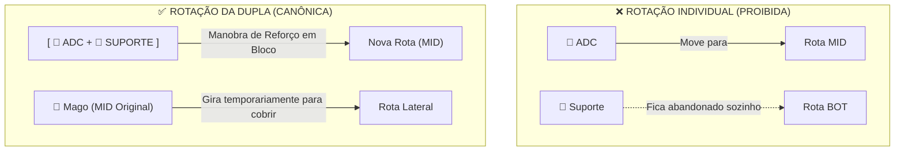
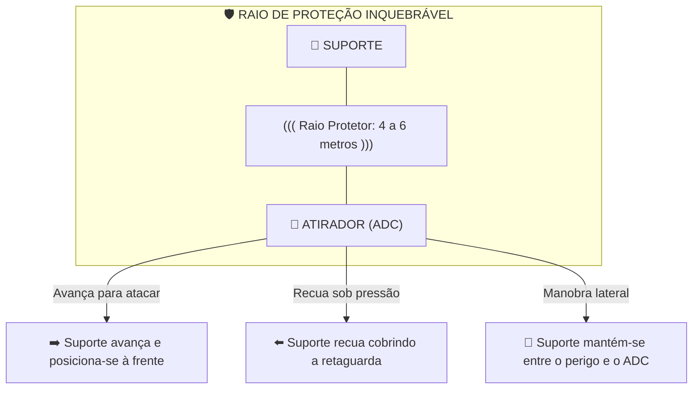
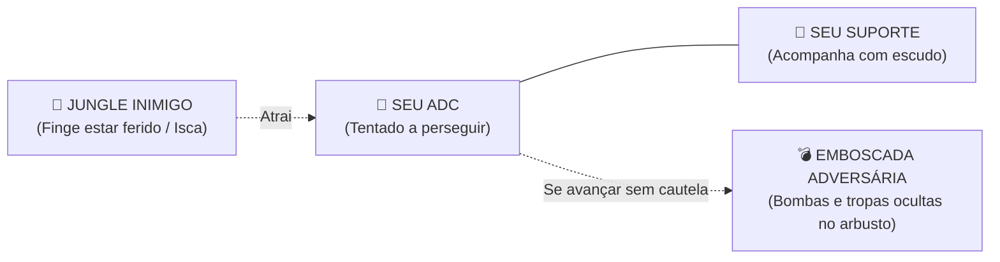
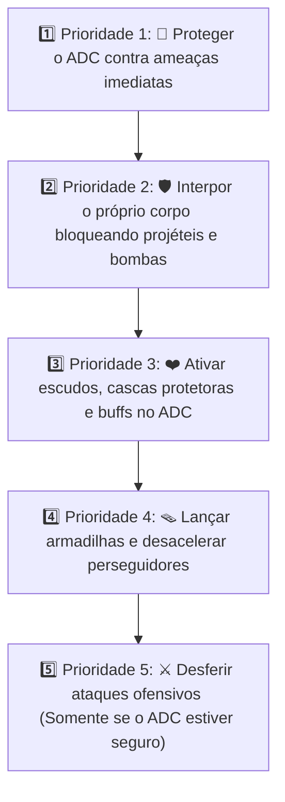

# 🐔⚔️ FOWLGEN WARS — AJUSTES DO SISTEMA DE TÁTICAS DE GUERRA
## O Sistema de Dupla Estratégica (ADC + Suporte) e a Regra do Vínculo Protetor

> **🎯 PRINCÍPIO FUNDAMENTAL DO DUO:**  
> O Atirador (ADC) é frágil e possui barra de vida reduzida, mas entrega o maior poder destrutivo e alcance do time.  
> O Suporte Defensor **não funciona como uma peça avulsa de rotação independente**: sua função vital é formar uma **dupla permanente com o ADC**, atuando como seu escudo vivo.  
> *“Onde o Atirador vai, o Suporte vai. O Suporte não existe para conseguir abates; existe para manter o ADC vivo causando dano.”*
>
> ⚠️ **NOTA DE ESCOPO DE DESENVOLVIMENTO:**  
> Este documento consolida o Game Design da camada macro de comando de unidades. No protótipo MVP do Hackathon 2026 (entrega em 10/10/2026), o jogador controla diretamente o seu herói principal enquanto as tropas seguem por waypoints na `Arena3Lanes`. Esta mecânica de Duo aplica-se tanto à IA de acompanhamento de campeões quanto ao modo tático expandido.

---

## 🎯 1. Formação Padrão dos 5 Campeões

Em vez de 5 peças soltas e desordenadas, as forças do jogador organizam-se em **4 unidades estratégicas funcionais**:

| Campeão | Classe / Arquétipo | Rota Padrão | Regra Operacional |
| :--- | :--- | :--- | :--- |
| 🛡️ **Tanque / Colosso** | Tanque / Defensor | **TOP** | Pressão constante de linha, absorção de dano e resistência. |
| 🧙 **MID** | Mago / Feiticeiro / Assassino | **MID** | Controle de rota central, dano explosivo e rotações rápidas. |
| 🐺 **Jungle / Hunter** | Caçador / Lutador | **JUNGLE** | Peça mais móvel do mapa: mobilidade, recursos e emboscadas. |
| 🏹 **ADC** | Atirador de Precisão | **ADC (Bot/Lateral)** | Maior dano contínuo à distância; alta fragilidade corporal. |
| 🧱 **Suporte** | Defensor / Protetor | **ADC (Bot/Lateral)** | **Sempre acompanha o ADC.** Escudo, cura, controle e absorção. |

> 📌 **REGRA ESTRUTURAL INEGOCIÁVEL:**  
> $$\text{🏹 ADC} + \text{🧱 SUPORTE} = \text{DUO INSEPARÁVEL}$$  
> O Suporte **não** abandona o ADC para ir ao MID de forma avulsa porque o jogador clicou numa rotação simples.

---

## 🧱🏹 2. O Sistema de Dupla no Tabuleiro de Batalha

O jogo interpreta o ADC e o Suporte como uma unidade militar de dois corpos:

```text
                     🏠 GALINHEIRO INIMIGO
                               ▲
                               │
                          🛡️ TANQUE
                               │
                           🧙 MID
                               │
                          🐺 JUNGLE
                               │
                    [ 🧱 SUPORTE + 🏹 ADC ]  <-- Unidade de Duas Peças
                               │
                               ▼
                    🏠 SEU GALINHEIRO (BASE)
```

O jogador gerencia as frentes de batalha com clareza mental:
> *“O Suporte existe exclusivamente para viabilizar que o ADC destrua o adversário sem ser abatido.”*

---

## 🔄 3. A Mecânica de Troca de Rota: Rotação da Dupla Inteira

O jogador pode mudar a estratégia e rotacionar campeões entre rotas, mas a rotação do Atirador é sempre em bloco:



### Exemplo Prático de Manobra:
1. O adversário agrupa 3 campeões pressionando a torre da Rota Central (MID).
2. O jogador aciona o comando: **`MANOBRA DE REFORÇO: DUO ➔ MID`**.
3. **🏹 ADC + 🧱 Suporte** deslocam-se juntos para o MID, criando superioridade numérica temporária imediata.
4. O **🧙 Mago do MID** reposiciona-se para cobrir a rota deixada pelo Duo ou contra-atacar outra frente.

---

## 🧠 4. O Raio de Proteção e Acompanhamento Automático

O Suporte obedece a um raio delimitado em torno do Atirador:



---

## ⚔️ 5. Perseguição do ADC e o Alerta de "Fora de Posição"

Se o ADC avança agressivamente perseguindo uma galinha inimiga em fuga:
$$\text{🏹 ADC} \quad\longrightarrow\quad \text{🐔} \quad\longrightarrow\quad \text{🐔} \quad\longrightarrow\quad \text{🐔}$$

O Suporte acompanha automaticamente em corrida de proteção ($\text{🧱} \rightarrow \text{🏹}$).  
No entanto, caso o Atirador ultrapasse o limite de segurança territorial da rota, a IA do Suporte aciona no HUD:

> ⚠️ **SINAL DE ALERTA: “FORA DE POSIÇÃO!”**

Isso força uma micro-decisão estratégica instantânea para o jogador:
* **Continuar perseguindo:** Risco alto de emboscada pela Jungle adversária em troca de um abate.
* **Recuar para a formação:** Preservar a vida do ADC e recompor a linha com o Suporte.

---

## 🪤 6. A Armadilha da Isca (Xadrez Aplicado)

Essa relação cria oportunidades táticas de ouro para ambos os lados:



O jogador atento faz a leitura:
> *“O adversário está recuando de propósito para isolar meu Atirador das tropas. Não vou cair nessa isca!”*  
> Ele cancela o avanço e mantém o Atirador em segurança atrás do Suporte.

---

## 🛡️ 7. Hierarquia de Prioridades da IA do Suporte

Quando não estiver sob comando manual direto, a árvore de decisões do Suporte opera nesta ordem estrita:



> **Princípio Central:** O Suporte não gasta recursos para infligir pequenos danos; ele gasta recursos para garantir que o Atirador permaneça vivo e disparando com 100% de cadência.

---

## ♟️ 8. As 4 Peças no Tabuleiro do Fowlgen Wars

A divisão operacional reduz o estresse cognitivo do jogador de 5 entidades dispersas para **4 peças táticas claras**:

```text
                                  FOWLGEN WARS
                                        │
           ┌────────────────────────────┼────────────────────────────┐
           ▼                            ▼                            ▼
   [ 🛡️ 1. O TANQUE ]           [ 🧙 2. O MAGO/MID ]        [ 🐺 3. O JUNGLER ]
   Combate solo contínuo        Dança de área e controle     A peça mais rápida e
   na rota superior (Top)       na rota central (Mid)        imprevisível do mapa
                                        │
                                        ▼
                        [ 🏹🧱 4. O DUO ESTRATÉGICO ]
                            Atirador (Dano Extremo)
                                       +
                            Suporte (Escudo Inviolável)
```

---

## 🔄 9. As Três Classes de Rotação

1. 🟢 **Troca Individual:** `🛡️ Tanque` $\longleftrightarrow$ Outra rota ou apoio temporário.
2. 🟡 **Troca Tática:** `🧙 Mid` $\longleftrightarrow$ Flanco móvel ou recomposição de torre.
3. 🔴 **Troca de Dupla (Indissociável):** `[ 🏹 ADC + 🧱 Suporte ]` $\longleftrightarrow$ Transição em bloco.  
   *(O ADC nunca rotaciona desacompanhado enquanto o Suporte estiver em campo).*

---

## 🏆 10. As Duas Regras de Ouro do Duo

1. > **“ONDE O ATIRADOR VAI, O SUPORTE VAI.”**
2. > **“O SUPORTE PROTEGE O ATIRADOR, MAS NUNCA O OBRIGA A FICAR PARADO.”**

O Atirador retém total liberdade para:
* Executar investidas rápidas.
* Esquivar-se de bombas em reação em cadeia.
* Flanquear torres pelas bordas do cenário.
* Destruir o Galinheiro no golpe de misericórdia final.

E o Suporte move-se dinamicamente no seu encalço como sua sombra blindada.

---

## 🎮 Conclusão de Game Design

Essa arquitetura entrega a **assinatura do FOWLGEN WARS**:
* 5 campeões geridos por 1 comandante.
* Redução mental de microgestão: o jogador move **peças estratégicas**, não marionetes isoladas.
* Síntese perfeita: **Ação de Mini-MOBA + Posicionamento de Xadrez + Caos Cômico das Galinhas Guerreiras**.
