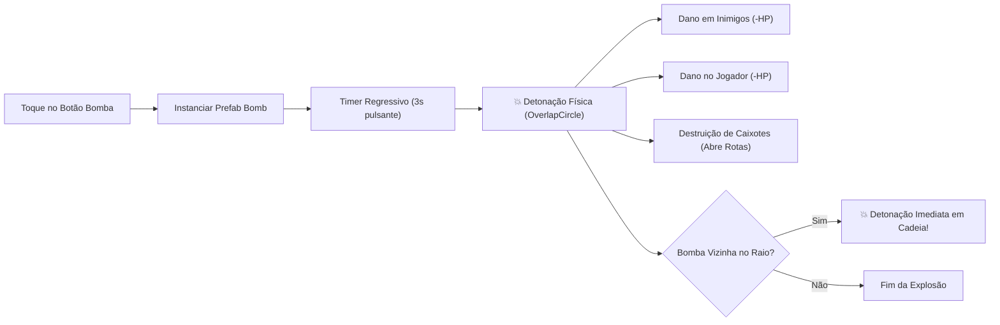
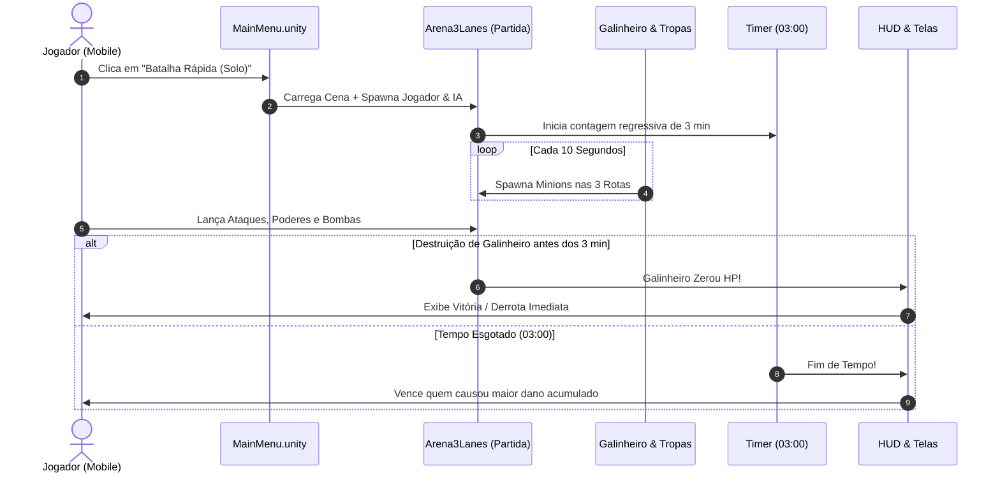
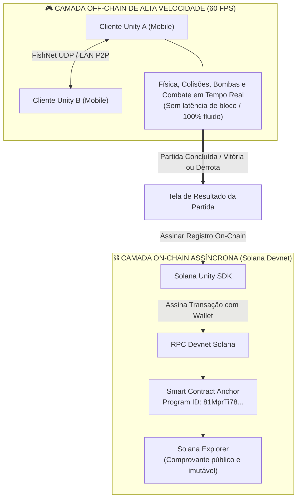

# 🐔 FOWLGEN WARS — MAPA TÉCNICO DA FASE 3
## Do Protótipo Incremental à Primeira Partida Completa Jogável (MVP Hackathon 2026)

> **🎯 PRINCÍPIO INEGOCIÁVEL DA FASE 3:**  
> **SIMPLES → FUNCIONAL → TESTADO → MELHORADO → COMPLEXO**  
> A Fase 3 **não** tenta construir o jogo finalizado de uma só vez. Ela constrói, degrau por degrau, um protótipo jogável cada vez mais robusto, eliminando o erro de colocar Unity + Web3 + multiplayer + economia + personagens + bombas + IA + UI para funcionar simultaneamente.
>
> **📅 PRAZOS E DATAS CRÍTICAS:**
> * **Entrega Interna do Jogo 100% Funcional:** **10 de outubro de 2026** (APK jogável, loop de 3 min, 3 rotas, colisões, SFX, transação Solana Devnet e multiplayer híbrido operantes).
> * **Deadline Oficial Colosseum Global Hackathon 2026:** **12 de outubro de 2026 às 23h59 PDT** (13 de outubro às 03h59 BRT).
> * **Margem de Segurança (Buffer):** 48h para homologação de QA (Maria Clara), gravação do pitch de ≤ 180s (Samuel/Ramiro) e submissão na Colosseum e Superteam Brasil.

---

## 🗺️ Tabela de Correspondência: 18 Níveis ↔ POCs do Hackathon

Este mapa técnico operacionaliza o [`Fowlgen-Roadmaps-Pocs-MVP-Hackathon.md`](Fowlgen-Roadmaps-Pocs-MVP-Hackathon.md) em 18 degraus de execução imediata:

| Nível | Nome do Degrau | POC Vinculada no Roadmap | Foco Técnico | Responsáveis |
| :---: | :--- | :--- | :--- | :--- |
| **01** | Primeiro Funcionamento | `POC-UNI-01` (Waypoints / Base) | Cena vazia, spawn do herói, movimento e câmera | Manuel / Marcos |
| **02** | Interação e Colisão | `POC-UNI-01` & `POC-UNI-02` | Chão, paredes, colisores físicos, detecção de contato | Manuel |
| **03** | Primeiro Combate | `POC-UNI-02` (Dano / HP) | Ataque básico, projétil, colisão, HP, morte e respawn | Manuel / Marcos |
| **04** | Habilidades (4 Botões) | `POC-UNI-03` (HUD / Inputs) | 4 slots: Ataque, Defesa, Especial, Supremo + Cooldowns | Manuel / Marcos |
| **05** | Bombas (Mecânica Central) | `POC-UNI-02` & `POC-UNI-03` | Spawn de bomba, timer, explosão física, área e cadeia | Manuel / Marcos |
| **06** | Galinheiro e Tropas | `POC-UNI-01` & `POC-UNI-02` | Spawner de tropas, avanço autônomo, alvo e combate | Manuel |
| **07** | Arena de 3 Rotas | `POC-UNI-01` (Arena3Lanes) | Galinheiro A/B, 3 rotas (Top, Mid, Bot), waypoints | Manuel |
| **08** | HUD e Experiência | `POC-UNI-03` (HUD Interativo) | Barras de HP, botões com feedback, timer, placar | Manuel / Maria Clara |
| **09** | Áudio e Feedback Sonoro | `POC-UNI-04` (AudioManager) | 5 SFX essenciais: ataque, explosão, botão, fanfarras | Jorge Espindola |
| **10** | Primeira Partida Completa | `POC-UNI-05` (Loop de Combate) | Conexão de todos os sistemas em um fluxo ininterrupto | Toda a Equipe |
| **11** | Loop de 3 Minutos | `POC-UNI-05` (Ritmo Mini-MOBA) | Escalada temporal: 00:00 início até 03:00 encerramento | Samuel / Manuel |
| **12** | Destruição Progressiva | `POC-UNI-02` (Obstáculos) | Obstáculos destrutíveis e alteração dinâmica da arena | Manuel |
| **13** | Armadilhas Personalizadas | Game Design Adicional | Ovo Congelante, ativação por proximidade e desaceleração | Manuel / Samuel |
| **14** | IA Simples (Modo Solo) | Fallback Offline do MVP | Máquina de estados: detectar inimigo, avançar e atacar | Marcos / Manuel |
| **15** | Progressão e Fair Play | Nivelamento Proporcional | Separação estrita de cosméticos vs poder (Anti-P2W) | Samuel / Junior |
| **16** | Multiplayer 1v1 FishNet | `POC-NET-01` (Host & Client) | Sincronização em tempo real LAN/P2P para o vídeo pitch | Marcos |
| **17** | Matchmaking & Salas | `POC-NET-01` (Lobby/Salas) | Entrada de 2 jogadores e handshake de conexão | Marcos / Jorge |
| **18** | Web3 / Solana Devnet | `POC-ANC-01..03` & `POC-INT-01..02` | Contrato Anchor (`81MprTi78...`), carteira e registro | Jorge / Marcos |

---

## 📊 Fluxo Visual da Escala Técnica (18 Níveis em 5 Blocos)

```mermaid
flowchart TD
    subgraph B1["🟢 BLOCO 1: NÚCLEO MECÂNICO (Níveis 1 a 4)"]
        N1["Nível 1: Primeiro Funcionamento<br/>(Cena + Movimento + Câmera)"] --> N2["Nível 2: Interação e Colisão<br/>(Paredes + Obstáculos + Dummy)"]
        N2 --> N3["Nível 3: Primeiro Combate<br/>(Ataque + Projétil + HP)"]
        N3 --> N4["Nível 4: 4 Habilidades<br/>(Ataque/Defesa/Especial/Supremo)"]
    end

    subgraph B2["🟡 BLOCO 2: BOMBAS, BASES E MAPA (Níveis 5 a 7)"]
        N4 --> N5["Nível 5: Sistema de Bombas<br/>(Timer + Raio + Cadeia)"]
        N5 --> N6["Nível 6: Galinheiro e Tropas<br/>(Spawners + Minions na Rota)"]
        N6 --> N7["Nível 7: Arena 3 Rotas<br/>(Top/Mid/Bot + Waypoints)"]
    end

    subgraph B3["🟠 BLOCO 3: UI, ÁUDIO E LOOP (Níveis 8 a 10)"]
        N7 --> N8["Nível 8: HUD e Feedback<br/>(HP + Cooldowns + Timer)"]
        N8 --> N9["Nível 9: Áudio e SFX<br/>(AudioManager + 5 SFX)"]
        N9 --> N10["Nível 10: 🏆 Primeira Partida Completa<br/>(Loop de Jogo Ininterrupto)"]
    end

    subgraph B4["🔴 BLOCO 4: RITMO, CENÁRIO E IA (Níveis 11 a 14)"]
        N10 --> N11["Nível 11: Partida de 3 Minutos<br/>(Cadência Temporal e Fases)"]
        N11 --> N12["Nível 12: Destruição Dinâmica<br/>(Obstáculos Quebráveis)"]
        N12 --> N13["Nível 13: Armadilhas Táticas<br/>(Ovo Congelante)"]
        N13 --> N14["Nível 14: IA Solo Offline<br/>(Fallback para Jurados)"]
    end

    subgraph B5["🟣 BLOCO 5: MULTIPLAYER E SOLANA (Níveis 15 a 18)"]
        N14 --> N15["Nível 15: Progressão Fair Play<br/>(Nivelamento Anti-P2W)"]
        N15 --> N16["Nível 16: FishNet 1v1 LAN<br/>(Sincronização 2 Smartphones)"]
        N16 --> N17["Nível 17: Lobby e Modos<br/>(Solo vs IA / Sala 1v1)"]
        N17 --> N18["Nível 18: Web3 / Solana Anchor<br/>(Devnet + Transação Explorer)"]
    end

    N18 --> FINAL["🏆 META FINAL: APK ANDROID HOMOLOGADO + VÍDEO PITCH ≤ 180s"]
```

---

## 🟢 NÍVEIS 1 A 4 — NÚCLEO MECÂNICO BÁSICO

### 🟢 NÍVEL 1 — PRIMEIRO FUNCIONAMENTO
* **Objetivo:** Fazer algo aparecer na tela e responder aos controles sem crashes.
* **Tarefas Atômicas:**
  1. Criar cena de teste limpa (`Test_CoreMovement.unity`).
  2. Adicionar o GameObject do personagem jogador com sprite/malha básica.
  3. Adicionar componente de movimentação (`PlayerMovement.cs` ou joystick virtual).
  4. Configurar câmera com script de acompanhamento suave (`CameraFollow.cs` ou Cinemachine).
  5. Testar execução no Editor Unity e gerar build de teste no Android.
* ✅ **Critério de Aceite (Só avançar quando):**  
  > O personagem aparece na cena, anda pelas 4 direções e a câmera o acompanha suavemente.

---

### 🟢 NÍVEL 2 — INTERAÇÃO E COLISÃO
* **Objetivo:** Fazer o personagem interagir fisicamente com o mundo sem atravessar obstáculos.
* **Tarefas Atômicas:**
  1. Criar chão com colisor (`BoxCollider2D` ou `Collider`).
  2. Criar paredes de delimitação e obstáculos estáticos.
  3. Configurar `Rigidbody` do personagem (modo cinemático ou dinâmico sem rotação em Z).
  4. Testar colisão: personagem encosta na parede e é fisicamente bloqueado.
  5. Criar um objeto de teste alvo (dummy) com colisor e tag `"Target"`.
  6. Detectar contato físico via `OnCollisionEnter` / `OnTriggerEnter` e disparar log no console.
* ✅ **Critério de Aceite (Só avançar quando):**  
  > O personagem navega na área sem atravessar paredes e detecta colisão com o alvo.

---

### 🟢 NÍVEL 3 — PRIMEIRO COMBATE
* **Objetivo:** Implementar o ciclo elementar: Ataque → Projétil → Colisão → Dano → Morte.
* **Tarefas Atômicas:**
  1. Criar botão ou comando de ataque básico.
  2. Instanciar projétil (ex.: ovo ou tiro de pena) na direção em que o personagem está virado.
  3. Implementar script de projétil (`Projectile.cs`) com velocidade e tempo de vida (*despawn*).
  4. Adicionar script de vida (`Health.cs`) no alvo: HP máximo = 100.
  5. Ao colidir com o alvo: aplicar `-10 HP`, instanciar efeito visual simples e destruir o projétil.
  6. Quando HP atingir zero: desativar o alvo (morte) e disparar respawn após 3 segundos.
* ✅ **Critério de Aceite (Só avançar quando):**  
  > Disparar ataque básico atinge o alvo, reduz sua barra de vida e causa morte/respawn comprovados.

---

### 🟢 NÍVEL 4 — HABILIDADES (OS 4 BOTÕES DO FOWLGEN)
* **Objetivo:** Estruturar a interface de poderes elementares documentados no GDD.
* **Tarefas Atômicas:**
  1. Criar 4 botões na UI:
     * ⚔️ **Ataque** (Ataque Básico / sem cooldown longo)
     * 🛡️ **Defesa** (Barreira de penas temporária / escudo por 2s)
     * ⚡ **Especial** (Disparo em leque ou avanço rápido com *dash*)
     * 💥 **Supremo** (Bomba de alto impacto ou chuva de ovos)
  2. Implementar máquina de estado de cooldowns (`CooldownTimer.cs`) com máscara radial na UI.
  3. Impedir ativação enquanto o poder estiver em recarga.
* ✅ **Critério de Aceite (Só avançar quando):**  
  > Cada um dos 4 botões executa sua respectiva ação, entra em cooldown visível e reativa após o tempo programado.

---

## 🟡 NÍVEIS 5 A 7 — ESTRATÉGIA, BOMBAS E ARENA

### 🟡 NÍVEL 5 — SISTEMA DE BOMBAS (MECÂNICA CENTRAL)
* **Objetivo:** Implementar a mecânica de assinatura do jogo começando com uma única bomba funcional.
* **Tarefas Atômicas:**
  1. Criar botão de plantar bomba no HUD.
  2. Instanciar prefab da Bomba (`Bomb.cs`) no chão logo à frente do personagem.
  3. Iniciar contagem regressiva visual (timer de 3 segundos com escala pulsante).
  4. Executar explosão: `Physics.OverlapSphere` ou `Physics2D.OverlapCircle` calculando raio de dano.
  5. Aplicar dano em área: inimigos, obstáculos destrutíveis e no próprio jogador caso esteja no raio.
  6. Permitir reação em cadeia: se a explosão atingir outra bomba, esta detona imediatamente.
* ✅ **Critério de Aceite (Só avançar quando):**  
  > A bomba é plantada, aguarda o timer, explode em área, causa dano e destrói objetos ao redor.

---

### 🟡 NÍVEL 6 — GALINHEIRO E SPAWNER DE TROPAS
* **Objetivo:** Criar o coração estratégico da base do Mini-MOBA.
* **Tarefas Atômicas:**
  1. Criar prefab do **Galinheiro** com script de base (`GalinheiroBase.cs`) contendo 500 de HP.
  2. Adicionar spawner automático: a cada 10 segundos, gera 1 tropa (minion).
  3. Tropa caminha autonomamente para frente ao longo do eixo da rota.
  4. Tropa detecta alvo inimigo no seu cone de visão, para a movimentação e desfere ataques automáticos.
  5. Criar segundo Galinheiro adversário com tropas de cor/tag oposta.
  6. Adicionar limite de tropas simultâneas (máximo 6 tropas por lado no protótipo).
* ✅ **Critério de Aceite (Só avançar quando):**  
  > Os dois Galinheiros geram tropas que se encontram no centro, entram em combate físico e aplicam dano mútuo.

---

### 🟡 NÍVEL 7 — ARENA DE 3 ROTAS (`Arena3Lanes`)
* **Objetivo:** Integrar o cenário canônico do hackathon com 3 rotas (Superior, Meio e Inferior).
* **Tarefas Atômicas:**
  1. Posicionar Galinheiro Amigo na esquerda e Galinheiro Inimigo na direita.
  2. Mapear as 3 rotas com nós de waypoints (`RouteWaypoints.cs`):
     * **Rota Superior (Top Lane):** rota de contorno com obstáculos.
     * **Rota Central (Mid Lane):** rota direta de confronto rápido.
     * **Rota Inferior (Bot Lane):** rota protegida com barreiras.
  3. Configurar as tropas para seguirem a lista de waypoints da rota selecionada sem travar em quinas.
  4. Posicionar 2 torres defensivas simples por rota para testar o avanço escalonado.
* ✅ **Critério de Aceite (Só avançar quando):**  
  > As tropas avançam organizadas pelas 3 rotas guiadas por waypoints sem atravessar a geometria do cenário.

---

## 🟠 NÍVEIS 8 A 10 — UI, ÁUDIO E LOOP DA PRIMEIRA PARTIDA

### 🟠 NÍVEL 8 — HUD E EXPERIÊNCIA DE COMBATE (JUNIOR & MANUEL)
* **Objetivo:** Fornecer leitura visual clara de tudo o que acontece sem necessidade de explicações externas.
* **Tarefas Atômicas:**
  1. Adicionar barra de vida flutuante sobre os personagens e Galinheiros.
  2. Organizar os 4 botões de habilidade e o botão de bomba no canto inferior direito para touch.
  3. Posicionar timer de partida decrescente centralizado no topo (`03:00`).
  4. Placar de tropas ativas e status das torres.
  5. Banner de fim de jogo com indicação cristalina de **VITÓRIA** ou **DERROTA**.
* ✅ **Critério de Aceite (Só avançar quando):**  
  > Qualquer pessoa que olhar para a tela compreende de imediato quanto HP tem, quais poderes estão prontos e quem está vencendo.

---

### 🟢 NÍVEL 9 — ÁUDIO E FEEDBACK SONORO (JORGE ESPINDOLA)
* **Objetivo:** Integrar o `AudioManager` com os 5 efeitos sonoros (SFX) essenciais do combate.
* **Tarefas Atômicas:**
  1. Implementar `AudioManager.cs` com canais de SFX e BGM regulados por AudioMixer.
  2. Integrar os 5 SFX mandatórios:
     * `sfx_chicken_attack`: golpe de pena/bicada.
     * `sfx_egg_hit`: impacto físico de dano.
     * `sfx_bomb_fuse_explode`: pavio aceso e estampido de detonação.
     * `sfx_ui_button_click`: clique tátil nos botões do HUD.
     * `sfx_fanfare_victory_defeat`: jingle de encerramento da partida.
  3. Adicionar triggers de som nos scripts `PlayerCombat.cs`, `Bomb.cs` e `GalinheiroBase.cs`.
* ✅ **Critério de Aceite (Só avançar quando):**  
  > Cada ação física do jogo (bater, explodir, clicar e vencer) emite seu respectivo áudio sem distorções ou atrasos.

---

### 🟠 NÍVEL 10 — PRIMEIRA PARTIDA COMPLETA (MARCO DA FASE 3)
* **Objetivo:** Conectar todo o pipeline em um fluxo ininterrupto de gameplay:
  $$\text{ENTRAR} \rightarrow \text{MAPA} \rightarrow \text{HERÓI} \rightarrow \text{TROPAS} \rightarrow \text{COMBATE} \rightarrow \text{BOMBAS} \rightarrow \text{FIM DE PARTIDA}$$
* **Tarefas Atômicas:**
  1. Clicar em "Batalha Rápida" no `MainMenu.unity`.
  2. Carregar a cena da arena, instanciar jogador, Galinheiros e iniciar o relógio.
  3. Jogador joga bombas, avança com suas tropas e destrói o Galinheiro rival (ou tem seu Galinheiro destruído).
  4. Ao zerar o HP do Galinheiro: pausar o loop, disparar fanfarra de áudio e exibir tela de resultado.
  5. Botão "Voltar ao Menu" funcionando perfeitamente sem vazamento de memória.
* 🎯 **Critério de Aceite (Grande Meta da Fase 3):**  
  > Uma partida completa do início ao fim é jogável do começo ao término sem crashes ou travamentos.

---

## 🔴 NÍVEIS 11 A 14 — RITMO, DINÂMICA E IA

### 🔴 NÍVEL 11 — O RITMO DA PARTIDA DE 3 MINUTOS
* **Objetivo:** Regular o ritmo emocional e estratégico da batalha para o padrão do hackathon:
  * `00:00 - 00:30`: Início, reconhecimento das rotas e primeiros confrontos.
  * `00:30 - 01:30`: Estratégia, uso de bombas nas torres e avanço de tropas.
  * `01:30 - 02:00`: Pressão intermediária e disputa do centro do mapa.
  * `02:00 - 02:30`: Escalada (Double Spawn de tropas ou recarga acelerada de bombas).
  * `02:30 - 03:00`: Caos final; se o tempo expirar, vence quem tiver causado mais dano ao Galinheiro adversário.
* ✅ **Critério de Aceite:**  
  > O temporizador governa as fases da partida com aumento perceptível de intensidade até o desfecho.

---

### 🔴 NÍVEL 12 — DESTRUIÇÃO PROGRESSIVA DE CENÁRIO
* **Objetivo:** Adicionar elementos destrutíveis que alteram as rotas de combate.
* **Tarefas Atômicas:**
  1. Criar caixotes/fardos de feno com 3 estados visuais: Intacto $\rightarrow$ Rachado $\rightarrow$ Destruído.
  2. Explosões de bombas abrem atalhos nas rotas entre a Mid Lane e as lanes laterais.
  3. Atualizar obstáculos para que tropas e jogadores possam circular pelas novas passagens.
* ✅ **Critério de Aceite:**  
  > Destruir um caixote com bomba remove a barreira de colisão e libera nova rota de passagem.

---

### 🔴 NÍVEL 13 — SISTEMA DE ARMADILHAS (OVO CONGELANTE)
* **Objetivo:** Introduzir a primeira armadilha tática de defesa.
* **Tarefas Atômicas:**
  1. Criar o prefab do **Ovo Congelante** (`FreezeTrap.cs`).
  2. Jogador posiciona a armadilha de forma invisível/semitransparente para inimigos.
  3. Quando uma tropa ou inimigo pisa no raio da armadilha: o ovo quebra.
  4. Aplica efeito de desaceleração de 60% na velocidade de movimento por 3 segundos.
* ✅ **Critério de Aceite:**  
  > Armadilha é acionada por aproximação física, aplicando desaceleração correta e destruindo-se após o uso.

---

### 🔴 NÍVEL 14 — IA BÁSICA DE COMBATE (MODO SOLO OFFLINE)
* **Objetivo:** Fornecer oponente autônomo para garantir que o jurado do hackathon jogue mesmo sem conexão.
* **Tarefas Atômicas:**
  1. `IA 1 — Percepção:` Inimigo patrulha sua rota até identificar alvo em raio de 8 metros.
  2. `IA 2 — Perseguição:` Move-se na direção do herói ou da tropa adversária.
  3. `IA 3 — Ação Ofensiva:` Estando em alcance de ataque, dispara projéteis ou planta bombas.
  4. `IA 4 — Preservação:` Se HP ficar abaixo de 25%, recua em direção ao seu Galinheiro.
* ✅ **Critério de Aceite:**  
  > A IA enfrenta o jogador de forma responsiva no modo "Batalha Rápida (Solo)" sem travar parada na arena.

---

## 🟣 NÍVEIS 15 A 18 — PROGRESSÃO, MULTIPLAYER E WEB3

### 🟣 NÍVEL 15 — PROGRESSÃO JUSTA (SISTEMA DE NIVELAMENTO PROPORCIONAL)
* **Objetivo:** Implementar o princípio fundamental de design anti-P2W do Fowlgen Wars.
* **Diretrizes Estritas:**
  1. A progressão de conta (XP, Nível de Perfil, Maestria) desbloqueia apenas opções visuais (skins de galinhas, ovos customizados, títulos e cosméticos).
  2. Em combate, todos os personagens de mesma classe compartilham os mesmos atributos básicos (HP normalizado, dano base padronizado).
  3. Nenhuma transação financeira ou ativo on-chain confere vantagem numérica de ataque ou defesa.
* ✅ **Critério de Aceite:**  
  > Partidas competitivas rodam com atributos matematicamente equalizados para ambos os lados.

---

### 🟣 NÍVEL 16 — MULTIPLAYER FISHNET 1V1 (`POC-NET-01`)
* **Objetivo:** Demonstrar 2 smartphones reais interagindo na mesma partida via rede local/P2P para o vídeo pitch.
* **Tarefas Atômicas:**
  1. Integrar o NetworkManager do FishNet na cena da partida.
  2. Jogador 1 atua como **Host** (servidor local + jogador).
  3. Jogador 2 conecta como **Client** através do IP local.
  4. Sincronizar via `NetworkTransform`: movimentação dos 2 heróis, tiros de projéteis e spawn de bombas.
  5. Sincronização do estado de vitória/derrota nos 2 aparelhos simultaneamente.
* ✅ **Critério de Aceite:**  
  > Duas instâncias independentes disputam a mesma arena com movimentação e ataques sincronizados.

---

### ⚫ NÍVEL 17 — SELEÇÃO DE MODO E LOBBY SIMPLES
* **Objetivo:** Permitir ao usuário escolher entre o modo offline e o modo multiplayer na interface.
* **Tarefas Atômicas:**
  1. Botão "Solo (vs IA)" carrega a partida local imediatamente.
  2. Botão "Criar Sala 1v1" inicia o servidor FishNet e exibe o código/IP da sala.
  3. Botão "Entrar na Sala" permite ao segundo aparelho digitar o IP e conectar.
* ✅ **Critério de Aceite:**  
  > Navegação fluida entre os dois modos de jogo a partir do menu inicial.

---

### ⚫ NÍVEL 18 — WEB3 / SOLANA DEVNET (`POC-ANC-01..03` & `POC-INT-01..02`)
* **Objetivo:** Integrar a camada blockchain sem comprometer o loop de gameplay em tempo real.
* **Arquitetura Desacoplada Mandatória:**
  $$\text{GAMEPLAY UNITY (Off-chain 60 FPS)} \quad\longleftrightarrow\quad \text{RESULTADO DA PARTIDA} \quad\longleftrightarrow\quad \text{ANCHOR ON-CHAIN (Solana Devnet)}$$
* **Tarefas Atômicas:**
  1. Manter o smart contract Anchor compilado e testado com 100% de sucesso via LiteSVM (`cargo test`).
  2. Program ID ativo e verificado na Solana Devnet: `81MprTi78xQvtVg9aaK4s4Cw9K62CU6PtcPYsChLNyxE`.
  3. No menu ou pós-jogo: conectar carteira (Phantom via Mobile Wallet Adapter ou Keypair Devnet).
  4. Ao término da partida: invocar instrução on-chain registrando a conclusão da partida.
  5. Gerar link verificável no Solana Explorer (`https://explorer.solana.com/tx/... cluster=devnet`).
* ✅ **Critério de Aceite:**  
  > A partida é jogada sem nenhum delay de rede blockchain, e o registro do resultado gera transação confirmada na Devnet.

---

## 👥 DISTRIBUIÇÃO OFICIAL DA EQUIPE (7 INTEGRANTES ATIVOS)

De acordo com o [`Fowlgen-Wars-Estrutura-da-Equipe-Planejamento-kanban-Fase2.md`](../files/Fowlgen-Wars-Estrutura-da-Equipe-Planejamento-kanban-Fase2.md) e [`Claude.md`](../Claude.md):

* 👑 **Samuel Menon Ramos (Product Owner & Game Designer & Gestão do Kanban):**  
  Define a visão do jogo, prioriza as tarefas no Kanban, valida o balanceamento do loop de 3 minutos, aprova os critérios de aceite e grava o vídeo pitch.
* 💻 **Marcos (Líder Técnico & Core Unity / Web3 / Multiplayer):**  
  Conduz a arquitetura técnica global, implementa a camada off-chain FishNet (`POC-NET-01`), gerencia os smart contracts Solana/Anchor junto a Jorge e coordena tecnicamente o time de desenvolvimento.
* 🕹️ **Manuel (Desenvolvedor Unity & Gameplay Core):**  
  Desenvolve o ambiente da arena (`Arena3Lanes`), waypoints de tropas, física e colisão de bombas/cenário, inputs de toque do jogador e integração dos 4 poderes.
* 🛡️ **Jorge Espindola (DevSecOps Engineer & Anchor Dev & Áudio):**  
  Responsável pelo `AudioManager` e integração dos SFX na Unity (`POC-UNI-04`), automação dos testes Anchor em Rust (`POC-ANC-01`), pipeline de CI/CD sem vazamento de chaves e documentação técnica de infraestrutura.
* 🎨 **Junior (Desenvolvedor Web & Gestor da Esteira de Prompts):**  
  Desenvolve o portal oficial em `app/` (React/Node.js/TypeScript) e formata as especificações de documentação e prompts em `prompt/skills/` com rigorosa checagem contra o `Claude.md`.
* 🧪 **Maria Clara (QA Funcional & UX & Lore):**  
  Testa exaustivamente cada APK gerado no smartphone físico Android, valida a jogabilidade e clareza do HUD e assegura a fidelidade do universo das galinhas guerreiras.
* 📢 **Ramiro (Marketing Estratégico & Relações com Investidores & Pitch):**  
  Estrutura o One-Pager, organiza a tese de produto para a Solana Mobile DApp Store e apoia Samuel na edição do vídeo pitch de demonstração para a banca de jurados.

---

## 🚨 REGRA DE OURO: DECOMPOSIÇÃO DE TAREFAS NO KANBAN

Se qualquer entrega parecer complexa ou intimidante:
> **QUEBRE EM PARTES MENORES DE EXECUÇÃO IMEDIATA.**

### Exemplo Prático: Como tratar o "Sistema de Bombas"
* ❌ **Errado (Card genérico e bloqueante):** "Desenvolver sistema de bombas do jogo" *(Estimativa irreal de 20 horas)*.
* ✅ **Correto (Cards atômicos e sequenciais):**
  1. `[ ]` Criar prefab do objeto bomba com colisor e sprite.
  2. `[ ]` Instanciar bomba no chão ao tocar no botão.
  3. `[ ]` Implementar contador decrescente de 3 segundos com animação de pulso.
  4. `[ ]` Criar raio de detecção de explosão (`OverlapCircle`).
  5. `[ ]` Aplicar dano no componente `Health.cs` dos alvos atingidos.
  6. `[ ]` Destruir caixotes de madeira atingidos pela explosão.
  7. `[ ]` Tocar o efeito sonoro `sfx_bomb_fuse_explode`.
  8. `[ ]` Adicionar cooldown de 5 segundos no botão do HUD.

Dessa forma, o desenvolvedor sabe exatamente qual linha de código escrever a cada hora, e a equipe avança com visibilidade contínua no quadro Kanban!

---

## 🏆 CHECKLIST DE ENTREGA FINAL DA FASE 3

Ao concluir os 18 níveis, o FOWLGEN WARS estará pronto para a submissão no Colosseum Hackathon:

- [ ] **Personagem e Câmera:** Movimento responsivo a 60 FPS com acompanhamento de câmera suave.
- [ ] **Física e Colisões:** Personagens, tropas e obstáculos colidem perfeitamente sem atravesse de malhas.
- [ ] **Ataque e 4 Poderes:** Ataque básico + 4 habilidades com timers de cooldown e feedback visual.
- [ ] **Mecânica de Bombas:** Plantio, contagem de tempo, explosão em área e destruição de barreiras.
- [ ] **Arena de 3 Rotas:** Galinheiros A e B gerando tropas que avançam por waypoints organizados.
- [ ] **HUD Intuitivo:** Barras de vida, botões táteis ergonômicos e timer de 3 minutos no topo.
- [ ] **Áudio Completo:** Os 5 efeitos sonoros essenciais disparando sincronizados às ações físicas.
- [ ] **Loop de Partida Fechado:** Fluxo contínuo desde o início até a tela de Vitória/Derrota.
- [ ] **Modo Híbrido Funcional:** Batalha Solo contra IA (offline) + Batalha 1v1 FishNet em rede local.
- [ ] **Smart Contract Solana Ativo:** Contrato Anchor testado (`cargo test`) com Program ID verificado na Devnet (`81MprTi78xQvtVg9aaK4s4Cw9K62CU6PtcPYsChLNyxE`) e transação de pós-jogo no Solana Explorer.
- [ ] **Build APK Android:** APK instalado e homologado por Maria Clara em aparelho físico.
- [ ] **Vídeo Pitch:** Vídeo dinâmico gravado com duração estritamente entre 2m40s e 2m50s (nunca $> 180$s).
