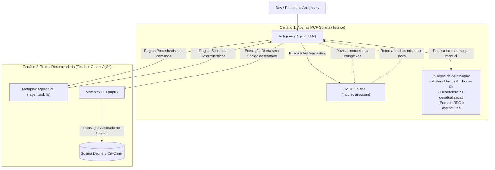

# Relatório Técnico: Metaplex Agent Skill + CLI (`mplx`) vs. MCP Solana

**Projeto:** FOWLGEN WARS  
**Destinatários:** Equipe de Desenvolvimento e Governança Web3  
**Data:** 03 de Outubro de 2026  
**Status:** Aprovado para Arquitetura Técnica  

---

## 🎯 1. Sumário Executivo

Ao integrar agentes de IA (como o Antigravity) ao ecossistema Solana/Metaplex para o **FOWLGEN WARS**, surge a dúvida de arquitetura: **o MCP oficial da Solana (`https://mcp.solana.com/mcp`) é suficiente sozinho, ou a adição da Skill oficial do Metaplex (`metaplex-foundation/skill`) com a CLI (`mplx`) é necessária?**

**Conclusão direta:** O MCP da Solana é excelente para **pesquisa teórica (RAG)**, mas **não possui capacidade de execução e não protege o agente contra conflitos de versões e alucinações de sintaxe**. A integração da **Metaplex Agent Skill + CLI (`mplx`)** fornece um roteamento procedural determinístico (*Progressive Disclosure*) e comandos de terminal diretos, reduzindo o risco de código quebrado a quase zero no desenvolvimento das POCs de NFTs e Tokenomics.

---

## 🏗️ 2. Arquitetura Comparativa



---

## ⚠️ 3. Os 3 Grandes Riscos de Usar Apenas o MCP da Solana

### 1. Poluição de Contexto e Conflito de Versões (Version Drift)
* O protocolo Metaplex evoluiu por três gerações: **Legacy Token Metadata (v1)** $\rightarrow$ **Umi / Candy Machine v3** $\rightarrow$ **Metaplex Core (v1.10+)**.
* O MCP da Solana indexa o ecossistema inteiro de uma vez só. Quando o agente consulta o MCP sobre *"como criar um NFT"*, ele recebe trechos mistos das 3 eras. O LLM frequentemente tenta usar pacotes legados como `@metaplex-foundation/js` (descontinuado) ou misturar métodos do `umi` com o `@solana/web3.js v2`.
* **Resultado:** Horas de depuração corrigindo erros de tipagem, imports inexistentes e funções depreciadas.

### 2. Incapacidade de Execução (O MCP é passivo)
* O MCP `solana-developer` possui apenas ferramentas de busca (`Solana_Documentation_Search`, `get_documentation`, `program_autofixer`). Ele **não executa transações**, **não tem acesso à carteira local** e **não faz deploy nem mint**.
* Para cada tarefa simples (como mintar 1 galinha para teste da POC 06), o agente precisa criar um arquivo `.ts`, instalar 10 pacotes no `package.json`, carregar o keypair, compilar com `ts-node` e tratar exceções.
* **Resultado:** Proliferação de scripts descartáveis e risco acidental de expor chaves no código.

### 3. Exaustão da Janela de Contexto (Context Bloat)
* Injetar centenas de linhas de documentação crua via RAG a cada pergunta sobrecarrega a janela de contexto do LLM.
* Com a janela poluída de documentação de rede, o agente perde o foco nas regras de negócio específicas do **FOWLGEN WARS** (atributos dos personagens, status das 18 torres, mecânicas de rota e classes).

---

## 🛡️ 4. Por que a Dupla "Skill Metaplex + CLI" Elimina Alucinações

### A. Roteamento por *Progressive Disclosure* (Skill)
O Metaplex Agent Skill foi desenhado especificamente para agentes autônomos. Em vez de despejar milhares de páginas de documentação:
* O arquivo principal `SKILL.md` funciona como um roteador leve de ~100 linhas.
* Quando o desenvolvedor pede *"crie uma galinha guerreira"*, o agente carrega estritamente o arquivo `references/cli-core.md`.
* As instruções contêm os argumentos exatos, flags obrigatórias e exemplos validados pelos próprios engenheiros da Metaplex Foundation.

### B. Execução Determinística com a CLI (`mplx`)
A CLI oficial (`@metaplex-foundation/cli`) encapsula toda a complexidade criptográfica, RPC, tratamento de slippage e serialização Borsh em binários testados:
* Suporte nativo à flag `--json` (o agente lê o retorno estruturado em JSON e valida o resultado instantaneamente).
* Autenticação segura apontando para a carteira local já configurada em `~/.config/solana/id.json` sem necessidade de expor chaves privadas no código do jogo.

---

## 📊 5. Matriz Comparativa Técnica

| Critério | Somente MCP Solana (`mcp.solana.com`) | Skill Metaplex + CLI (`mplx`) |
| :--- | :--- | :--- |
| **Poder de Execução** | ❌ Apenas leitura / consulta teórica | ✅ Executa mints, TGE e registros on-chain |
| **Taxa de Alucinação em Código** | ⚠️ Alta (mistura bibliotecas legadas e novas) | 🟢 Quase nula (flags e schemas pré-validados) |
| **Tempo para Realizar um Mint Devnet** | ⏱️ 5 a 15 min (gerar script, instalar deps, rodar) | ⚡ < 5 segundos (`mplx core asset create`) |
| **Consumo de Memória / CPU** | 🟡 Dependente de conexão SSE remota | 🟢 Zero (arquivos `.md` lidos sob demanda) |
| **Suporte ao Metaplex Core (POC 06)** | ⚠️ Parcial (requer prompts detalhados) | 🎯 Nativo com suporte a plugins e atributos |
| **Suporte a Tokenomics (Genesis / TGE)** | ❌ Sem ferramentas diretas de pool | 🎯 Suporte completo a bonding curves e Raydium |
| **Segurança de Carteiras (Devnet)** | ⚠️ Risco de chave exposta em script gerado | 🔒 Isolamento nativo na configuração da CLI |

---

## 🧪 6. Estudo de Caso Prático no FOWLGEN WARS

### Cenário: Mintar o personagem 'FOWLGEN #001' (Rooster / Warrior / Common)

#### Fluxo usando apenas o MCP da Solana:
1. O agente busca docs de NFT no MCP.
2. Recebe exemplos antigos usando `mpl-token-metadata` clássico com contas Master Edition e Metadata separadas (custo de aluguel: ~0.022 SOL).
3. Escreve um script `scripts/mint.ts` de 60 linhas.
4. O script falha por erro de versão de dependência `@solana/web3.js`.
5. O desenvolvedor precisa intervir para corrigir o código.

#### Fluxo usando Metaplex Skill + CLI (`mplx`):
1. O agente consulta `cli-core.md` da Skill.
2. Identifica imediatamente o padrão **Metaplex Core** (1 única conta, custo de aluguel: ~0.003 SOL).
3. Executa diretamente:
   ```bash
   mplx core asset create \
     --name "FOWLGEN #001" \
     --uri "https://arweave.net/metadata.json" \
     --plugin attributes='[{"key":"Species","value":"Rooster"},{"key":"Class","value":"Warrior"}]' \
     --json
   ```
4. O Asset ID é gerado, validado e registrado na POC sem criar lixo no repositório.

---

## 📋 7. Recomendação Final para a Equipe

1. **Manter o MCP da Solana ativo:** Ele é nosso oráculo para dúvidas profundas da arquitetura Solana, Anchor e consultas gerais do ecossistema.
2. **Manter a Skill do Metaplex no projeto (`.agents/skills/metaplex`):** Ela não adiciona peso ao repositório e garante que o Antigravity utilize as melhores práticas atuais do Metaplex Core e Genesis.
3. **Manter a CLI `mplx` instalada no ambiente de desenvolvimento:** Ela agiliza os testes da POC 06 (NFTs) e POC 07 (Tokenomics), permitindo focar 100% no desenvolvimento do jogo na Unity.
