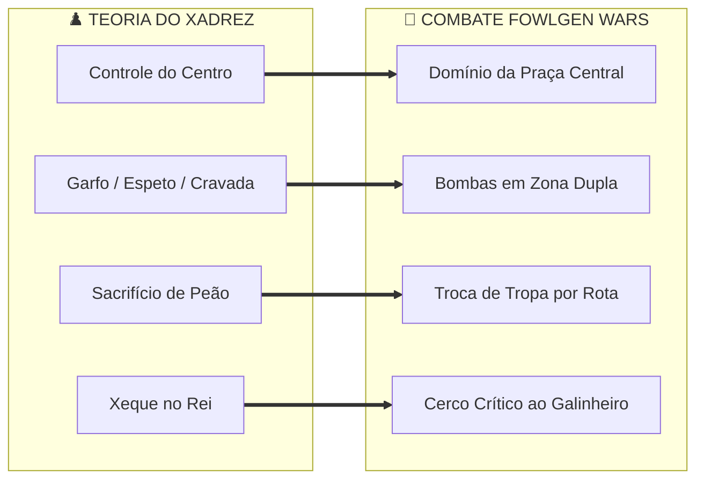
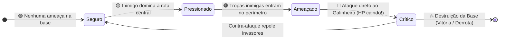
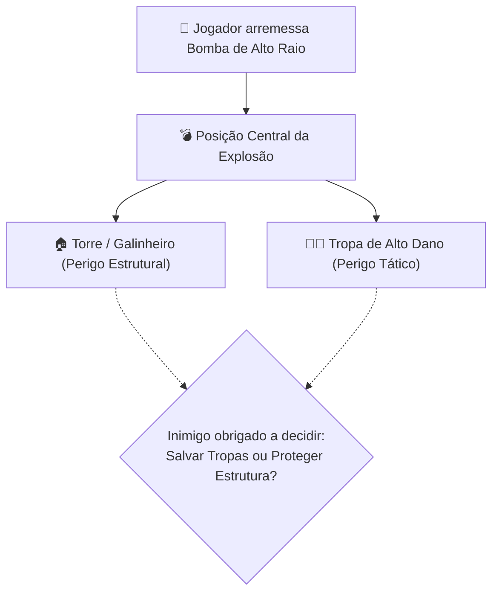
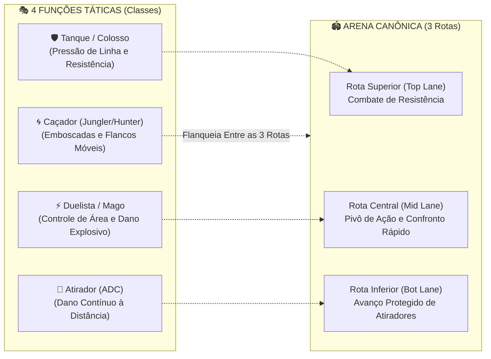

# ♟️ FOWLGEN WARS — SISTEMA DE TÁTICAS DE BATALHA
## Estratégia Inspirada no Xadrez + Ação Frenética de Mini-MOBA

> *“Pense como no xadrez. Aja como em uma batalha.”*  
> A proposta do FOWLGEN WARS não é transformar o jogo em xadrez clássico de turnos. O xadrez entra como uma **camada intuitiva de tomada de decisão** dentro de uma partida ágil, caótica e acessível. O jogador não precisa conhecer xadrez para jogar em alto nível.

---

## 🎯 1. Objetivo do Sistema

As mecânicas táticas devem induzir o jogador ao raciocínio antecipatório contínuo:
> *“Se eu fizer isso agora, o que ele vai fazer depois?”*

Esse dinamismo opera **sem obrigá-lo a pausar a ação** para calcular dezenas de variantes. O equilíbrio de design baseia-se em:  
$$\text{Ação Rápida} + \text{Decisões Simples} = \text{Consequências Estratégicas Profundas}$$

| ❌ O QUE NÃO QUEREMOS | ✅ O QUE QUEREMOS |
| :--- | :--- |
| Partidas lentas e burocráticas | Posicionamento dinâmico e leitura de espaço |
| Dezenas de regras complexas de memorizar | Oportunidade e timing de disparo |
| Exigência de conhecimento prévio de xadrez | Leitura de intenção do adversário |
| Vantagem exclusiva para enxadristas | Ataques combinados e emboscadas com bombas |
| Movimentação engessada em tabuleiro por turnos | Iscas, sacrifícios táticos e decisões de risco/recompensa |

---

## ♟️ 2. O Xadrez Vira Conceito, Não Regra

O FOWLGEN WARS não copia o tabuleiro de 64 casas nem a movimentação geométrica das peças. Ele traduz conceitos consagrados do xadrez em **comportamentos orgânicos de batalha em tempo real**:

| Conceito no Xadrez | Equivalência no FOWLGEN WARS | Descrição Prática em Combate |
| :--- | :--- | :--- |
| **Controle do Centro** | **Controle de Área Central** | Dominar a praça central para pivotar rapidamente entre rotas. |
| **Desenvolvimento** | **Preparação das Tropas** | Agrupar minions e coordenar avanço com a onda certa. |
| **Tempo** | **Momento Certo para Agir** | Guardar uma habilidade ou bomba para o instante de impacto máximo. |
| **Ataque Duplo (Garfo)** | **Habilidade Multi-Alvo / Foco Duplo** | Uma única bomba ou projétil que ameaça duas unidades ou estruturas. |
| **Garfo Estratégico** | **Pressão em Dois Objetivos** | Pressionar o Galinheiro e ao mesmo tempo ameaçar a linha de suporte. |
| **Cravada (Pin)** | **Fixação de Unidade Defensiva** | Forçar um tanque a ficar estático para não expor a base. |
| **Espeto (Skewer)** | **Ameaça Escalonada** | Forçar o recuo do alvo primário, expondo a tropa que estava atrás. |
| **Sacrifício** | **Troca de Tropa por Posição** | Deixar uma unidade morrer para plantar uma bomba decisiva. |
| **Roque** | **Reposicionamento Rápido** | Habilidade de evacuação, barreira ou reagrupamento defensivo. |
| **Promoção do Peão** | **Evolução / Buff Temporário** | Tropa sobrevivente que atinge a base ganha ataque aumentado. |
| **Estrutura de Peões** | **Formação de Tropas** | Frente resistente (tanques) protegendo atiradores frágeis. |
| **O Rei** | **O Galinheiro (Base Principal)** | O coração da vitória; destruí-lo encerra o jogo imediatamente. |
| **Xeque** | **Ameaça Direta ao Galinheiro** | Tropas e heróis inimigos invadindo a zona de defesa da base. |
| **Xeque-Mate** | **Destruição do Galinheiro** | Zera o HP da base adversária: Fim de Partida e Vitória! |



---

## 🐔 3. O Galinheiro é o “Rei”

No xadrez, o Rei é o objetivo estratégico final. No FOWLGEN WARS, **o Galinheiro é o Rei**.

A regra mestra do jogo é intuitiva:
> 🏠 **PROTEJA SEU GALINHEIRO.**  
> 💥 **DESTRUA O GALINHEIRO INIMIGO.**

O estado de segurança do Galinheiro possui 4 gradientes de tensão para alertar o jogador no HUD:



1. 🟢 **Seguro:** Nenhuma tropa adversária no quadrante defensivo; rotas equilibradas.
2. 🟡 **Pressionado:** Oponente controlando o centro e empurrando a linha de waypoints.
3. 🟠 **Ameaçado:** Ataque iminente com heróis e tropas no raio de visão das torres.
4. 🔴 **CRÍTICO (Xeque):** Dano direto sendo aplicado à barra de vida do Galinheiro.

---

## 🎯 4. Controle do Centro

No xadrez, o domínio das casas centrais amplia o raio de ação das peças. No FOWLGEN WARS:
> *Controlar o centro significa controlar mais opções táticas de rota.*

Quem assegura a praça central do mapa pode:
* Rotacionar rapidamente entre as rotas (Top, Mid e Bot).
* Emboscar tropas inimigas que avançam pelas laterais.
* Interceptar o jogador rival antes que ele plante bombas perto da sua base.
* Garantir acesso aos recursos e power-ups neutros da arena.

> [!IMPORTANT]  
> **Equilíbrio de Fair Play:** O centro **não concede dano extra passivo**. Ele concede **vantagem de posicionamento e tempo de resposta**, impedindo o efeito bola de neve injusto (*snowball*).

---

## ⚡ 5. O Princípio do “Tempo” — A Decisão Certa no Momento Exato

No xadrez, um lance ganha força pelo timing de execução. No FOWLGEN WARS:
> *Uma habilidade poderosa usada no segundo errado é uma habilidade desperdiçada.*

### Exemplo Prático com Bombas
O inimigo agrupou duas tropas na rota. Você tem uma bomba pronta:
* **Opção A (Apressada):** Jogar a bomba de imediato $\rightarrow$ Causa dano em 1 inimigo e o outro desvia.
* **Opção B (Timing Enxadrista):** Aguardar 2 segundos até o adversário convergir no afunilamento de caixotes $\rightarrow$ Detonação atinge ambos e causa reação em cadeia com um barril!

A Opção B não exige estudo enxadrístico; ela surge naturalmente como: *“Esperei o momento certo”*.

---

## 🍗 6. Formação de Tropa

O jogador não controla apenas o herói, mas atua como comandante de campo junto aos minions gerados pelo Galinheiro. Isso espelha a coordenação da estrutura de peões:

```text
         [ 🛡️ Tanque ]       [ 🛡️ Tanque ]     <-- Linha de Frente (Absorção de Impacto)
                     \       /
                  [ ⚔️ Herói Melee ]            <-- Ponto de Ruptura
                     /       \
         [ 🔥 Mago ]         [ ⚡ Atirador ]    <-- Retaguarda (DPS à Distância)
```

### Formações de Combate
* 🛡️ **Linha Defensiva:** Tropas robustas na frente retendo projéteis para proteger a base.
* ⚔️ **Linha Ofensiva:** Tropas velozes pressionando a torre enquanto o herói flanqueia.
* 🎯 **Formação de Suporte:** Unidades de controle de grupo congelando o solo para atiradores finalizarem.
* 🐔 **Formação Híbrida:** Equilíbrio versátil entre avanço de rotas e segurança do Galinheiro.

---

## 🦊 7. As Táticas de Combate na Prática

### 7.1. Ataque Duplo (O “Garfo”)
Inspirado no garfo do cavalo no xadrez. Uma única ação física obriga o inimigo a escolher entre duas perdas:


> **Regra de Ouro:** Uma boa tática sempre força o adversário a fazer uma escolha desconfortável.

---

### 7.2. Cravada (The Pin)
No xadrez, uma peça não pode se mover porque abriria ataque a uma peça de maior valor.  
No FOWLGEN WARS:
* O herói tanque rival está posicionado na entrada do Galinheiro.
* Em vez de enfrentá-lo frontalmente, você posiciona atiradores pelas laterais que só podem ser bloqueados se ele se deslocar.
* Se ele sair da posição, o Galinheiro fica desprotegido para suas bombas; se ele ficar parado, suas tropas tomam a rota inteira.
* O tanque adversário fica **cravado** à função de escudo passivo.

---

### 7.3. Espeto (The Skewer)
Ao contrário da cravada, a ameaça inicial é no alvo principal:
1. Você inicia um bombardeio direto à porta do Galinheiro inimigo.
2. O adversário é forçado a abandonar a rota intermediária para correr em socorro da base.
3. No instante em que ele recua, seu aliado avança pela retaguarda desguarnecida e varre todas as tropas e torres secundárias.

---

### 7.4. Sacrifício Tático
Perder uma unidade intencionalmente para obter uma vantagem territorial esmagadora:
$$\text{Sacrificar 1 Minion na Rota Direita} \quad\longrightarrow\quad \text{Adversário gasta cooldowns} \quad\longrightarrow\quad \text{Invasão fulminante pela Rota Central}$$
Momentos cinematográficos em que o jogador atrai bombas para si mesmo para que suas tropas avancem livres até o Galinheiro rival.

---

### 7.5. Isca e Emboscada (Gambit)
Fingir um ataque precipitado à base rival:
1. Jogador avança isolado, dispara um ovo e recua fingindo fraqueza.
2. O adversário persegue agressivamente prevendo uma eliminação fácil.
3. Ao dobrar a esquina do caixote: encontra **3 bombas pré-plantadas** e tropas prontas para o contra-ataque.

---

### 7.6. Roque (Reagrupamento Estratégico)
Inspirado na manobra de segurança do Rei:
* Habilidade especial de **“Reagrupamento do Galinheiro”**:
  * Ao ser ativada, puxa o herói em *dash* defensivo de volta ao raio do Galinheiro.
  * Concede escudo temporário de penas a todas as tropas sobreviventes no perímetro.
  * Transforma a defesa de emergência na mola propulsora de um contra-ataque imediato.

---

### 7.7. Promoção do Peão (Evolução de Tropa)
Uma tropa que cruza toda a extensão da arena e alcança o terço final do campo adversário sem morrer ganha o estado **“Galo Furioso”** ($\text{🐣} \rightarrow \text{🐔} \rightarrow \text{🦾🐔}$):
* Aumento temporário de tamanho e velocidade de ataque (+30%).
* Efeito visual de crista flamejante.
* Risco alto de conduzir a tropa, mas recompensa maciça se ela atingir o destino.

---

## 🗺️ 8. Papéis Táticos e Compatibilidade de Rotas

O FOWLGEN WARS opera tanto com a macrovisão do Mini-MOBA (4 funções) quanto com a **Arena Canônica de 3 Rotas (`Arena3Lanes`) do MVP**:



* **Função Suporte (Transversal):** Opera em qualquer rota oferecendo desaceleração de oponentes (armadilhas de gelo), escudos e controle de visão.

---

## ⏱️ 9. As Táticas na Cadência da Partida de 3 Minutos

```mermaid
timeline
    title 🕒 Cronograma Tático da Partida de 3 Minutos
    00:00 Abertura : Posicionamento inicial : Escolha da rota : Primeiro avanço de tropas
    00:30 Primeiro Confronto : Leitura das intenções adversárias : Trocação de dano básico
    01:00 Primeira Tática : Uso do timing da bomba : Controle do centro : Primeiro "garfo"
    01:30 Pressão e Escolha : Galinheiro sob ameaça : Decisão entre atacar ou defender
    02:00 Contra-Ataque : Aproveitar overextension do rival : Limpeza de rota e contra-golpe
    02:30 Caos e Destruição : Reações em cadeia de bombas : Desespero defensivo
    03:00 Decisão Final : Xeque-mate na base ou vitória por pontos de dano acumulado
```

---

## 🧠 10. As Cinco Regras de Ouro do Game Design Tático

1. **Fácil de Aprender:** O jogador absorve a mecânica jogando intuitivamente, sem tutoriais maçantes.
2. **Difícil de Dominar:** Mestres do jogo aprendem a sincronizar trajetórias de bombas com armadilhas.
3. **A "Regra dos 3 Segundos":** Toda leitura tática e decisão de ação deve levar no máximo 3 segundos:
   $$\text{Olhar a Arena} \quad\longrightarrow\quad \text{Detectar Abertura} \quad\longrightarrow\quad \text{Executar o Toque}$$
4. **Sempre Existe Contra-Jogada:** Nenhuma estratégia é absoluta; para cada bomba plantada, há esquiva, escudo ou contra-ataque.
5. **Ação Contínua:** O pensamento tático flui em paralelo à movimentação; o jogador nunca fica imóvel calculando.

---

## ⚖️ 11. Fair Play e Nivelamento Proporcional

O sistema de táticas de batalha conecta-se umbilicalmente ao princípio de integridade competitiva do FOWLGEN WARS:
> *Vitórias decorrem de mérito de posicionamento, leitura de jogo e timing de bombas — nunca de status numéricos comprados.*

* Jogadores no nível 1 e no nível 50 enfrentam-se com os mesmos atributos proporcionais de combate.
* Cosméticos, títulos e skins colecionáveis (Web3 / Metaplex Core) expressam maestria e estilo, sem interferir na física do combate.

---

## 🐔♟️ Resumo Estratégico

```text
                               FOWLGEN WARS
                                     │
                          MINI-MOBA DE 3 MINUTOS
                                     │
                   ┌─────────────────┴─────────────────┐
                   ▼                                   ▼
              [ 💥 AÇÃO ]                         [ ♟️ TÁTICA ]
         Ataque Básico & Projéteis            Posicionamento e Espaço
         Bombas & Reação em Cadeia            Controle do Centro
         Tropas nas 3 Rotas                   Timing (O Momento Certo)
         Destruição de Cenário                Iscas e Sacrifícios
                                              Cravadas e Ataques Duplos
                   │                                   │
                   └─────────────────┬─────────────────┘
                                     │
                                     ▼
                        [ 🏠 O GALINHEIRO (REI) ]
                                     │
                         VITÓRIA OU DERROTA FINAL
```

> **🔥 PRINCÍPIO FINAL:**  
> O FOWLGEN WARS não exige que o jogador pense como um grão-mestre de xadrez para começar.  
> Ele faz o jogador **descobrir que estava pensando como um grande estrategista** enquanto gargalhava e se divertia com a batalha de galinhas!
